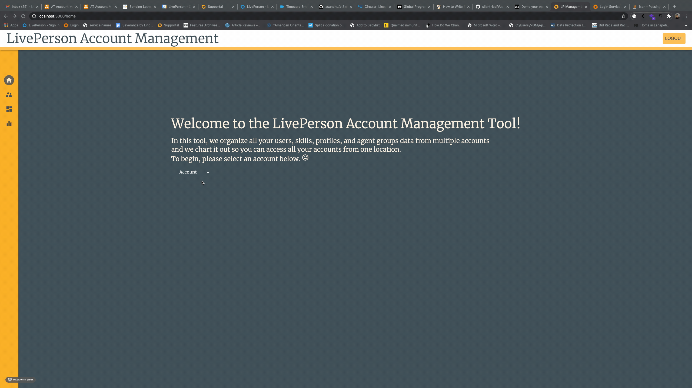
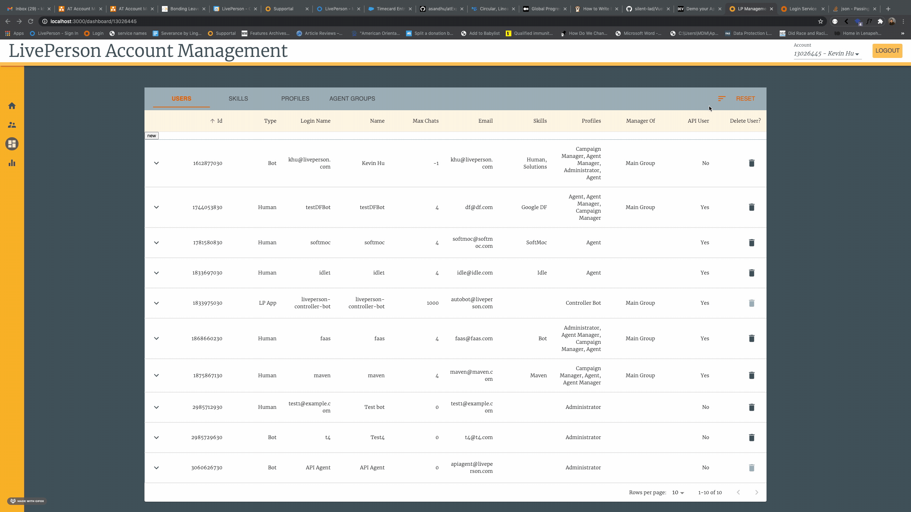
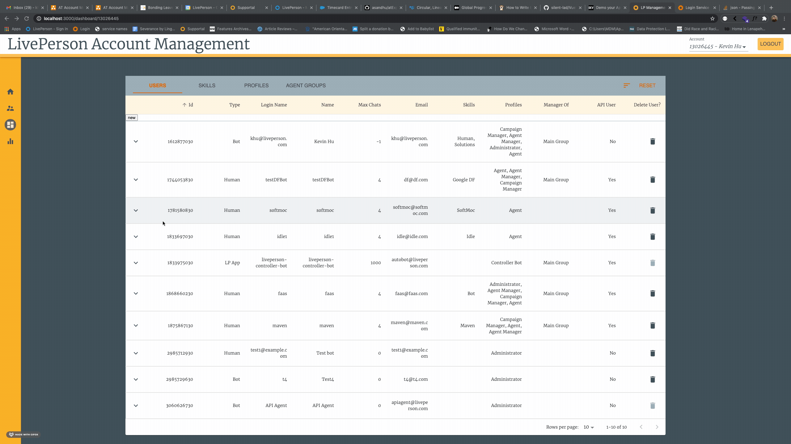
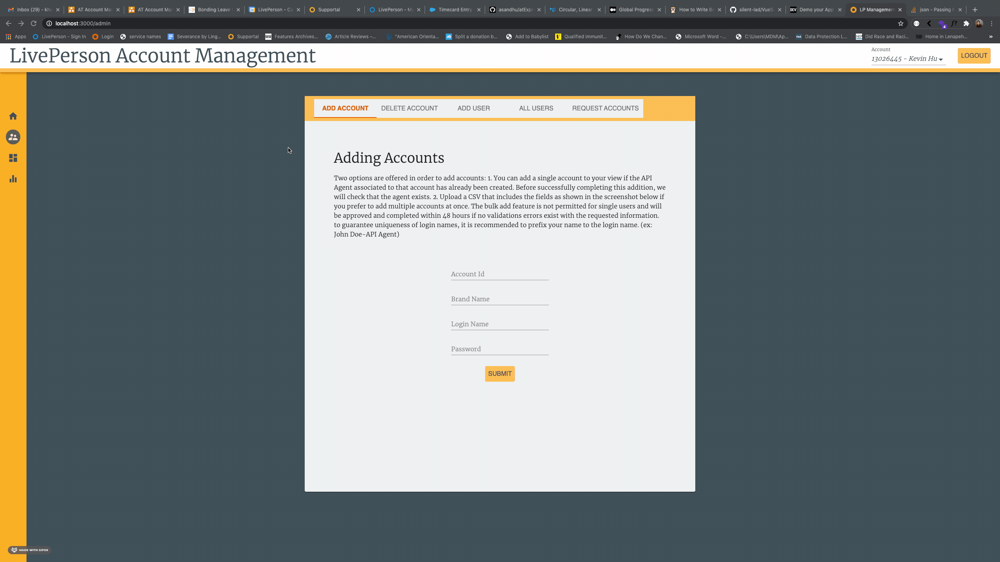
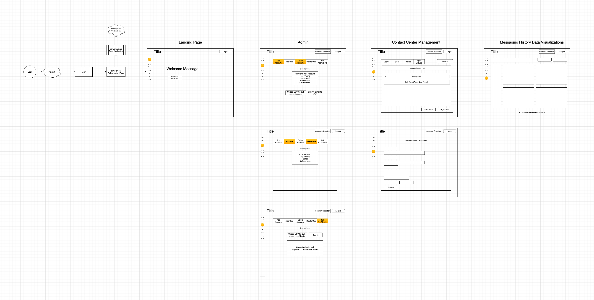

# Autotrader Account Management Tool Frontend

## Getting Started
This is the frontend application to the Autotrader Account Management Tool created to offer a multi-account view application for managerial use.
<br/><br/>
<br/><br/>
<br/><br/>
<br/><br/>

## Available Scripts
Can run with either `npm` or `yarn`
- `start`
- `test`
- `build`
- `eject`

## Setting up your environment
1. Install [node.js 14.0](https://nodejs.org/en/download/)
2. `git clone` the repo and `cd gm-sterling-middleware`
2. Run `npm i --save` to install all node dependencies
3. Run `npm run build` to builds the app for production to the build folder – all files bundled for optimal performance
4. Run `npm run start` to start application

## File Structure
```
Source Folder
📦src
 ┣ 📂assets
 ┣ 📂components
 ┃ ┣ 📂admin
 ┃ ┃ ┣ 📂adminDash
 ┃ ┃ ┗ 📂adminForm
 ┃ ┣ 📂dashboard
 ┃ ┃ ┣ 📂accountDropDown
 ┃ ┃ ┣ 📂dashboardLoading
 ┃ ┃ ┣ 📜Dashboard.tsx
 ┃ ┃ ┗ 📜styles.ts
 ┃ ┣ 📂errors
 ┃ ┃ ┗ 📂errorModal
 ┃ ┣ 📂forms
 ┃ ┣ 📂home
 ┃ ┣ 📂login
 ┃ ┣ 📂search
 ┃ ┃ ┣ 📂searchFilter
 ┃ ┃ ┗ 📂searchPopper
 ┃ ┣ 📂table
 ┃ ┃ ┣ 📂appPrivilegesPopper
 ┃ ┃ ┣ 📂deleteModal
 ┃ ┃ ┣ 📂tableBody
 ┃ ┃ ┣ 📂tableData
 ┃ ┃ ┣ 📂tableHeader
 ┃ ┃ ┣ 📂tableRow
 ┃ ┃ ┣ 📂tableSubRow
 ┃ ┃ ┗ 📂tableToolbar
 ┃ ┣ 📂toolbar
 ┃ ┣ 📂utilitybar
 ┃ ┗ 📜index.ts
 ┣ 📂config
 ┣ 📂store
 ┃ ┣ 📂accounts
 ┃ ┣ 📂admin
 ┃ ┣ 📂agentGroups
 ┃ ┣ 📂appkeys
 ┃ ┣ 📂auth
 ┃ ┣ 📂campaigns
 ┃ ┣ 📂enhancers
 ┃ ┣ 📂middleware
 ┃ ┣ 📂profiles
 ┃ ┣ 📂skills
 ┃ ┣ 📂table
 ┃ ┣ 📂users
 ┃ ┣ 📜allActions.ts
 ┃ ┗ 📜index.ts
 ┣ 📂themes
 ┃ ┣ 📜breakpoints.ts
 ┃ ┣ 📜index.ts
 ┃ ┣ 📜overrides.ts
 ┃ ┣ 📜palette.ts
 ┃ ┗ 📜typography.ts
 ┣ 📂util
 ┃ ┣ 📂components
 ┃ ┗ 📂store
 ┣ 📜App.css
 ┣ 📜App.tsx
 ┣ 📜index.tsx
 ┣ 📜react-app-env.d.ts
 ┗ 📜styles.ts

Component Folder Structure
┣ 📂COMPONENT
  ┣ 📜AdminDash.tsx
  ┗ 📜styles.ts

Store Reducer Structure
┣ 📂REDUCER
  ┣ 📜actions.ts
  ┣ 📜reducer.ts
  ┗ 📜types.ts
 ```

## Architecture

1. **Login** <br/>
The login is built with Liveperson SSO. It redirects to the authorization url set through liveperson sentinel service, established in conversation cloud application, and verify user credentials with liveperson first. Afterwards, it verifies against the management tool application database to guarantee user has been granted permissions. LPA Users and Super Users both have the power to grant users access to application. LPA Users are automatically created in the database the first time they attempt accessing the application.

2. **Landing Page** <br/>
The landing page welcomes the user to the application and offers a basic description(A tour feature may eventually be added to help new users navigate as it scales). It invites user to select an account to view data. Accounts are only preloaded as they've been added to the user's permissions.

3. **Admin** <br/>
The admin section gives user ability to edit their data access within this application. There are three tiers of users: Standard Users, Super Users, and LPA Users.<br/><br/>
- `standard users` can add/delete individual accounts to their own view. To add individual accounts, the user must make sure the API Agent has already been manually added as a user within requested account. A verification check is performed to check this before information can be saved to the database. If standard users want to perform a bulk add/delete, they have to upload a csv and submit it as a request to an LPA user. 
- `super users` have all standard user permissions plus the ability to grant a new user access to this application
- `lpa users` have full access to all permissions, including the ability to bulk add and bulk delete on behalf of other users by uploading a csv in designated structure

4. **Contact Center Management** <br/>
The contact center management is very similar to conversational cloud where users are aloud to read and write to data given access to them. The interface offers some different features like the ability to access Auth1.0 keys immediately and to toggle to see privileges for those keys. The bread and butter is really the option to dynamically change the account readily to render contact center data across multiple accounts.


